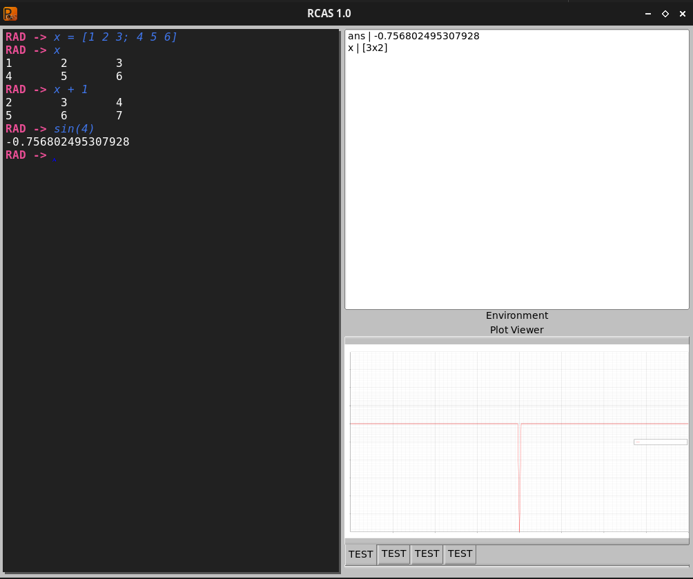

# Rcas

#### Rcas (Rust Computer Algebra System) is a packaged environment set out with the goal of being somewhat similar in functionality to matlab.

There currently exists Matrix and common Linear Algebra functions, as well as mathematical operations.

